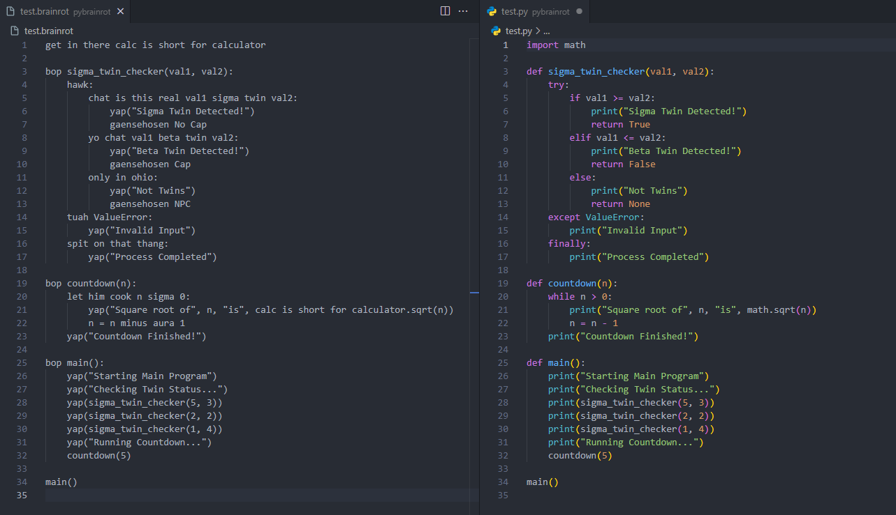

# Pybrainrot
Python for brainrotted people.

Pybrainrot is a Python preprosessor which translates regular Python code into brainrot by replacing certain keywords, operators, and built in functions with iPad kid vocabulary.

*Implementation based on [PyGyat](https://github.com/shamith09/pygyat).*

## Features

 * Write Python using brainrot terms instead.

 * Run PyBrainrot files using the `pybrainrot` command, just like Python.

 * Translate Python files to pybrainrot and vice versa.

 * Real Python keywords that have defined pybrainrot mappings will not be allowed.

## Code example


## Installation

To install it you can use `git clone` and do a local install:

```
$ git clone https://github.com/nicicalu/pybrainrot.git
$ cd pybrainrot
$ pip3 install .
```

To uninstall, run

```
$ pip3 uninstall pybrainrot
```

which will undo the installation.

## Keyword mappings

Below is a table of all of the Python keywords or operators that should be replaced by their corresponding pybrainrot keyword. Python keywords that don't have a mapping or aren't in this table can just be used as is. If you want to request that a new mapping be made, please submit a pull request.

| Brainrot Keyword/Operator                          | Python Translation |
| -------------------------------------------------- | ------------------ |
| before gta6                                        | async              |
| zitat ende gaensehosen                             | return             |
| yap                                                | print              |
| rizz                                               | +                  |
| no cap                                             | True               |
| cap                                                | False              |
| let him cook                                       | while              |
| not stonks                                         | raise              |
| lock in                                            | from               |
| straight to jail                                   | exit               |
| calc is short for calculator i am just using slang | math               |
| chat is this real                                  | if                 |
| yo chat                                            | elif               |
| only in ohio                                       | else               |
| ich muss raus                                      | break              |
| hawk                                               | try                |
| tuah                                               | except             |
| spit on that thang                                 | finally            |
| minus aura                                         | -                  |
| just using slang                                   | def                |
| get in there                                       | import             |
| skibidi                                            | class              |
| just put the fries in the bag bro                  | for                |
| edge                                               | continue           |
| sus                                                | assert             |
| pookie                                             | with               |
| ass                                                | as                 |
| GOAT                                               | global             |
| hans get se flammenwerfer                          | del                |
| NPC                                                | None               |
| unc                                                | self               |
| huzz                                               | range              |
| sigma twin                                         | >=                 |
| beta twin                                          | <=                 |
| twin                                               | ==                 |
| sigma                                              | >                  |
| beta                                               | <                  |
| diddy                                              | in                 |
| pluh                                               | pass               |


## Quick intro

pybrainrot works by first translating pybrainrot files (suggested file ending: .brainrot) into Python-files, and then using Python to run them. You therefore need a working installation of Python for pybrainrot to work.


To run a pybrainrot program, simply type

```
$ pybrainrot source.brainrot arg1 arg2 ...
```

to run `source.brainrot` with arg1, arg2, ... as command line arguments. If you want more details on how to run pybrainrot files (flags, etc), type

```
$ pybrainrot -h
```

to print the built-in help page. You can also consult the man page by typing

```
$ man pybrainrot
```

pybrainrot also includes a translator from Python to pybrainrot. This is found via the `py2brainrot` command:

```
$ py2brainrot test.py
```

This will create a pybrainrot file called `test.brainrot`. A full explanation of `py2brainrot`, is found by typing

```
$ py2brainrot -h
```